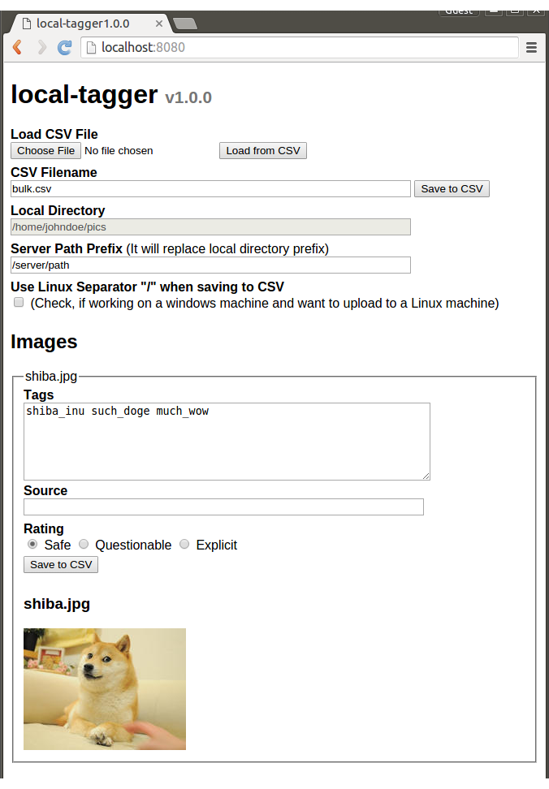

# Tagaa - (タガー)
A program that helps with tagging images locally.

## Purpose
Tagging a collection of images properly can take a lot of time especially if
done online and one by one. Tagaa can be used locally. It can load a collection of
images and present them in the same window which makes tagging easier. More
importantly it allows to save your work and resume it another time.

As a latest feature, Tagaa also allows for easy uploads to the
https://kusubooru.com server.


## Usage
* Download the latest [release](https://github.com/kusubooru/tagaa/releases)
  for your platform.
* Place the executable into a folder with images and launch. (Note: You might
  be asked to give the program permission to run.)
* You might see the program's server running on a console window but it will
  attempt to open a browser window.
* If the browser window does not open automatically then visit
  http://localhost:8080 on your preferred browser.
* Tag your images.
* Click any of the 'Save to CSV' buttons.
* When you are done with the program you can close the browser window but you
  have to also close the server running on the console window with Ctrl+C.

### Screenshot


### Details
Tagaa will launch a web interface in a new browser window, which
allows to add tags, source and rating on each image that is contained in the
current directory (or the one specified by the -dir option). Subfolders are
ignored. Supported types: "gif", "jpeg", "jpg", "png", "swf"

The web interface allows to save the image metadata in a CSV file by clicking
any of the 'Save to CSV' buttons. After the tags and the other metadata have
been saved to the CSV file, you may close the program and resume your tagging
the next time. If a CSV file with the name 'bulk.csv' (or a name specified by
the -csv option) is found, it will be loaded automatically on start up.

### Command Line Options
```sh-session
	$ ./tagaa
```
With the default options, Tagaa will:

1. Search for images in the current directory.
2. Try to load ./bulk.csv and if it doesn't exist it will create it.
3. Start a new server at http://localhost:8080 and then launch a browser window
   to that address.

```sh-session
	$ ./tagaa -dir ~/myfolder -csv mybulk.csv -port 8888
```
With the above options, Tagaa will:

1. Search for images under ~/myfolder.
2. Try to load ~/myfolder/mybulk.csv and if it doesn't exist it will create it.
3. Start a new server at http://localhost:8888 and then launch a browser window
   to that address.

## For Shimmie2 users

On its current iteration, Tagaa acts as a user interface for the 'Bulk Add CSV'
extension of Shimmie2. You can enable that extension from the Extension Manager
of your Shimmie2 installation.

This extension expects a CSV file which contains the paths of the images, their
tags, sources and ratings. Tagaa helps with creating that CSV file which you
can then upload on your server (along with the images). You can then visit the
'Board Admin' menu of your Shimmie2 installation, go to the 'Bulk Add CSV'
section and paste the path of the CSV file on your server before you click the
Add button.

You need to make sure that the paths of the images stored in the CSV file are
the same as their path on your server. To help with that, you can change the
'Server Path Prefix' in the Tagaa program (click the Advanced+ button).

### Example
Let's assume you are using Tagaa to tag images locally on a Windows machine and
your images are under `C:\Users\John\Desktop\cute-images`.

You are planning to upload the CSV and the images on a Linux machine under
`/home/john/uploads/cute-images`.

You will need to click the Advanced+ button on Tagaa, set `/home/john/uploads` as
the 'Server Path Prefix' and also check the 'Use Linux Separator "/" when
saving to CSV' option.
